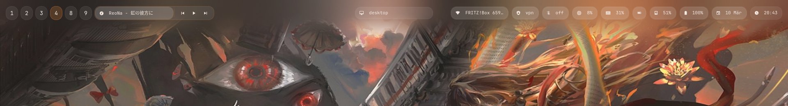
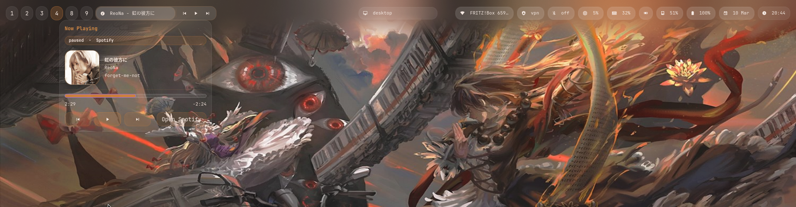
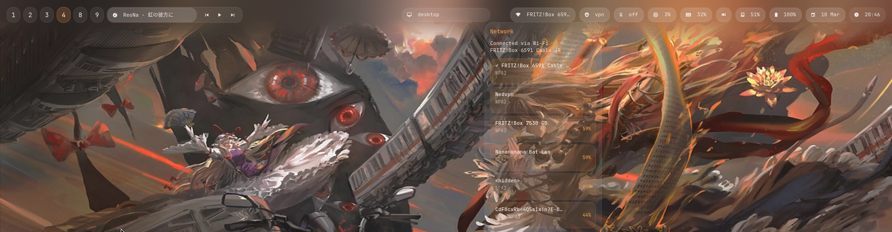
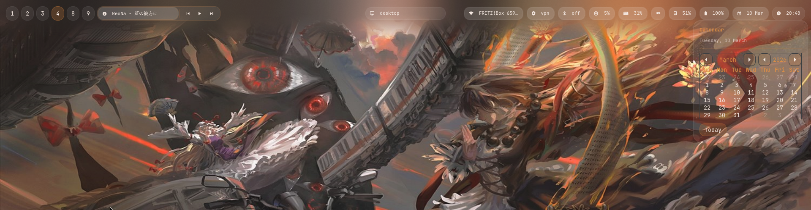

# gtk-hypr-shell

A custom GTK4 top bar for Hyprland built with `gtk4-layer-shell`.

This project replaces a typical Waybar setup with one native GTK shell app. The bar, attached popovers, and compact keyboard OSD all live in the same app, which makes the UI feel more consistent and gives you proper widget-attached popups instead of screen-positioned hacks.

The current look is a muted translucent gray/orange theme with compact bubbles, attached popovers, media controls, and small volume/brightness overlays.

This is first and foremost my personal setup. It is published because it works well and because the code is straightforward enough to adapt, not because it is trying to be a universal drop-in desktop shell for every machine.

## What It Includes

- a GTK4 layer-shell top bar for Hyprland
- occupied-only workspace buttons
- centered active window title
- inline media controls plus a richer media popover
- Wi-Fi, VPN, Bluetooth, battery/power, calendar, CPU, RAM, GPU, and disk popovers
- compact keyboard OSD for volume and brightness
- helper scripts for media, stats, and OSD updates

## Screenshots






## Why This Exists

Waybar is great, but once you want popovers to feel truly attached to the widgets above them, it starts getting awkward. This bar was rebuilt in GTK4 so the bar and its UI all belong to the same toolkit and the same process.

That gives you:

- native attached popovers
- one consistent styling system
- easier future expansion
- no dependence on offset-based popup placement

## Personal Setup, Not a Framework

This repo reflects one real Hyprland setup:

- one `1920x1080` display in the current layout
- Hyprland as the compositor
- GTK4 + `gtk4-layer-shell` for the bar and popovers
- NetworkManager, PipeWire/WirePlumber, BlueZ, and `powerprofilesctl`
- NVIDIA GPU support through `nvidia-smi`

If you use different tools, that is fine, but you will probably want to adjust parts of it instead of copying everything unchanged.

The easiest places to customize are:

- [`gtk-shell/style.css`](gtk-shell/style.css)
  - colors, spacing, bubble shape, popover styling, OSD styling
- [`gtk-shell/shell.py`](gtk-shell/shell.py)
  - module layout, popover content, icon/text choices, refresh behavior
- [`gtk-shell/scripts/`](gtk-shell/scripts)
  - media, OSD, and stat helper behavior
- your own `hyprland.conf`
  - startup line, keybinds, and any workflow-specific bindings

If you only want the visual style, start with `style.css`.

If you want to change behavior, start with `shell.py`.

If you want different keybinds or a different control flow for volume/brightness, update Hyprland and the helper scripts together.

## Dependencies

### Core runtime

These are the packages the shell expects to find:

- `python`
- `python-gobject`
- `gtk4`
- `gtk4-layer-shell`
- `hyprctl`
- `jq`

### Features used by the current bar

- `playerctl` for media metadata and controls
- `wireplumber` / `wpctl` for volume control
- `brightnessctl` for brightness control
- `networkmanager` / `nmcli` for Wi-Fi and VPN
- `bluez` and `bluez-utils` / `bluetoothctl` for Bluetooth
- `power-profiles-daemon` / `powerprofilesctl` for power profiles
- `lm_sensors` for CPU temperatures
- `kitty` and `nmtui` for fallback network/VPN management

### Optional

- `nvidia-utils`
  - only needed if you want NVIDIA GPU stats through `nvidia-smi`
- `spotify` or `spotify-launcher`
  - only needed if you want the dedicated Spotify launch integration
- `protonvpn` or `protonvpn-app`
  - optional shortcut from the VPN popover

### Arch / EndeavourOS

```bash
sudo pacman -S python python-gobject gtk4 gtk4-layer-shell jq playerctl wireplumber brightnessctl networkmanager bluez bluez-utils power-profiles-daemon lm_sensors kitty
```

Optional:

```bash
sudo pacman -S nvidia-utils spotify-launcher
```

## Install

### 1. Clone the repo

```bash
git clone https://github.com/Yayky/gtk-hypr-shell.git
cd gtk-hypr-shell
```

### 2. Install the bar files

```bash
./install.sh
```

This copies the `gtk-shell/` folder into:

```text
~/.config/gtk-shell
```

If you already have a real directory at that path, the installer backs it up first.

The installer does not rewrite your `hyprland.conf` automatically. You still need to add the startup line and any keybinds you want yourself.

### 3. Start it from Hyprland

Add this to your `hyprland.conf`:

```ini
# exec-once = waybar
exec-once = ~/.config/gtk-shell/start.sh
```

A minimal snippet is included here:

- [examples/hyprland.conf.snippet](examples/hyprland.conf.snippet)

### 4. Optional but recommended: wire the OSD keybinds

If you want the built-in GTK volume and brightness OSD, use these Hyprland binds:

```ini
bind = , XF86AudioRaiseVolume, exec, ~/.config/gtk-shell/scripts/volume-osd.sh up
bind = , XF86AudioLowerVolume, exec, ~/.config/gtk-shell/scripts/volume-osd.sh down
bind = , XF86AudioMute, exec, ~/.config/gtk-shell/scripts/volume-osd.sh mute

bind = , XF86MonBrightnessUp, exec, ~/.config/gtk-shell/scripts/brightness-osd.sh up
bind = , XF86MonBrightnessDown, exec, ~/.config/gtk-shell/scripts/brightness-osd.sh down
```

If you keep your old direct `wpctl` / `brightnessctl` binds, the bar still works, but the GTK OSD will not appear.

### 5. Reload Hyprland

```bash
hyprctl reload
```

Or just log out and back in.

## Updating

If you installed by copying the files into `~/.config/gtk-shell`, update like this:

```bash
cd gtk-hypr-shell
git pull
./install.sh
hyprctl reload
```

If you prefer the repo to be your live source of truth, you can symlink it instead:

```bash
ln -s ~/projects/gtk-hypr-shell/gtk-shell ~/.config/gtk-shell
```

That way, edits in the repo immediately affect the live bar.

## Adapting It For Your Own Setup

If you want to make this your own, these are the most likely adjustments:

### Theme

Edit [`gtk-shell/style.css`](gtk-shell/style.css):

- bubble colors
- popover colors
- font sizes
- spacing
- border radius
- OSD look

### Layout

Edit [`gtk-shell/shell.py`](gtk-shell/shell.py):

- move or remove modules
- change which bubbles appear on the left, center, or right
- adjust popover width/content
- change media presentation

### System integration

Edit the helper scripts in [`gtk-shell/scripts`](gtk-shell/scripts):

- change volume logic if you do not use `wpctl`
- change brightness logic if you do not use `brightnessctl`
- change media integration if you use a different player flow
- adjust stat collection if your hardware differs

### Hyprland integration

Edit your own Hyprland config:

- startup line
- media/volume/brightness keybinds
- workspace bindings
- any terminal or launcher commands used by popovers

### Hardware-specific notes

- if you do not use NVIDIA, GPU metrics may need to be replaced or disabled
- if you do not use NetworkManager, the Wi-Fi/VPN popovers will need rework
- if you do not use BlueZ/Bluetooth, that part can be removed cleanly

## Project Layout

```text
gtk-shell/
  shell.py                main GTK4 bar app
  style.css               bar, popover, and OSD styling
  start.sh                launcher used by Hyprland
  assets/
    spotify.svg           fallback media art
  scripts/
    popup-data.sh         RAM / GPU / disk helper data
    spotify.sh            media control helper
    volume-osd.sh         volume wrapper for the GTK OSD
    brightness-osd.sh     brightness wrapper for the GTK OSD
    osd-write.sh          tiny event writer for the OSD
examples/
  hyprland.conf.snippet
docs/screenshots/
install.sh
```

## Notes

- Spotify artwork is cached under `~/.cache/gtk-shell`
- GPU stats currently target NVIDIA through `nvidia-smi`
- some fallback actions intentionally open external tools such as `nmtui`
- the bar is designed specifically for Hyprland and `gtk4-layer-shell`

## Troubleshooting

### The bar does not show up

Check that Hyprland is launching:

```ini
exec-once = ~/.config/gtk-shell/start.sh
```

Also make sure `gtk4-layer-shell` is installed.

### Volume keys change audio but no OSD appears

Make sure your Hyprland audio binds point to:

```text
~/.config/gtk-shell/scripts/volume-osd.sh
```

and not directly to `wpctl`.

### Brightness keys work but no OSD appears

Make sure your brightness binds point to:

```text
~/.config/gtk-shell/scripts/brightness-osd.sh
```

and not directly to `brightnessctl`.

### GPU popup shows no data

Install `nvidia-utils` and confirm `nvidia-smi` works on your system. If you are not on NVIDIA, that part of the popup is expected to stay unavailable.

### Network or VPN actions look empty

This bar reads Wi-Fi and VPN data from NetworkManager. Make sure:

- `NetworkManager` is installed and running
- your connections are managed by `nmcli`

## License

This project is licensed under the MIT License. See [LICENSE](LICENSE).
